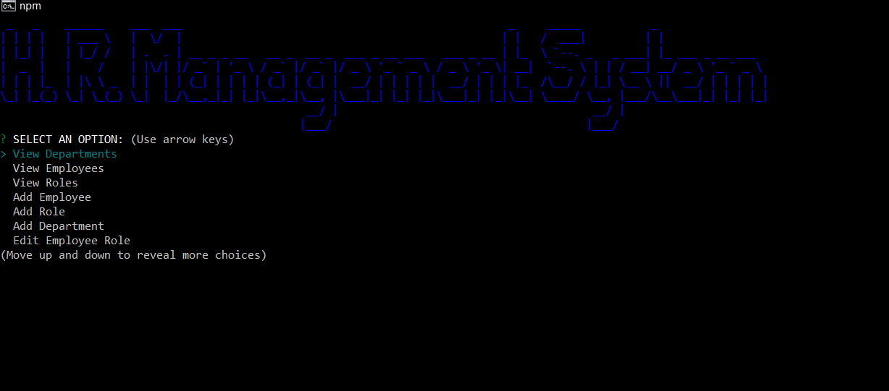

#  HR-Manager-CMS   

  ##  Description

***

  This application is a command line tool for managing employees, and other Human Resources categories, of an organization. This app uses NodeJS and MySQL, along with several NPM packages.
  
  ## Table Of Contents  

***
  * [Description](#Description)
  * [Table Of Contents](#table-of-contents)
  * [Installation](#Installation)
  * [Usage Instructions](#usage-instructions)
  * [Contribution Guidelines](#contribution-guidelines)
  * [Testing Instructions](#testing-instructions)
  * [License](#License)
  * [Questions?](#questions)

  ##  Installation

***

  ### Clone the repository: 
    git clone git@github.com:faerodev/HR-manager-CMS.git  
      
  ### Dependencies:  
  The following dependencies are required for use:  
 * nodejs
 * mysql
 #
 Plus the following NPM packages:
 * mysql2
 * inquirer
 * console.table
 * figlet
 * chalk
 * dotenv(optional)  
  
  ### Additional Installation Instructions:

    
  * This application requires node JS and Mysql to be installed prior to running. 
  * To install this application you must clone this repository to your machine.
  * Once cloned, open mysql and create a database named hr_tracker - copy and paste the text from schema.sql located in the cb directory of this repo into the mysql command line for the database you just created - this creates the necessary tables in th database for the app to run. - you can then close mysql.
  * Navigate to the cloned directory on you machine and run `npm install`
  * Open the .env.example file and add you database password in the DB_PASSWORD line - then save the file and rename it to .env

  ##  Usage instructions  

***
    
  * To use the app run `npm start` in the repo directory.
  * The application will start and you will be presented with a list of options.
  * Select whichever option you desire and follow the on screen prompts to create, view, and edit different Human Resources categories, such as Departments, Roles, and Employees.
    
  ##  Contribution Guidelines  

***
    
  If you would like to contribute to this project, please [add me on GitHub](https://github.com/faerodev)
    
  ##  Testing Instructions  

  ***
    
  N/A  
    
  ##  License

  ***
      
  This project is covered under the  license.  
    
  See attached [LICENSE](./LICENSE) file for details.  
    
  ##  Questions?  

  ***
  
  If you have any questions regarding this application you can reach me using the below contact information:  
  ### Contact Info  
    
  GitHub: [FaeroDev](https://github.com/faerodev)

  Email:  faerodev@gmail.com
